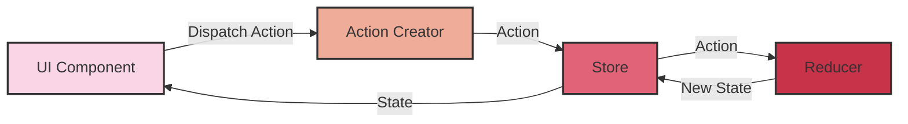
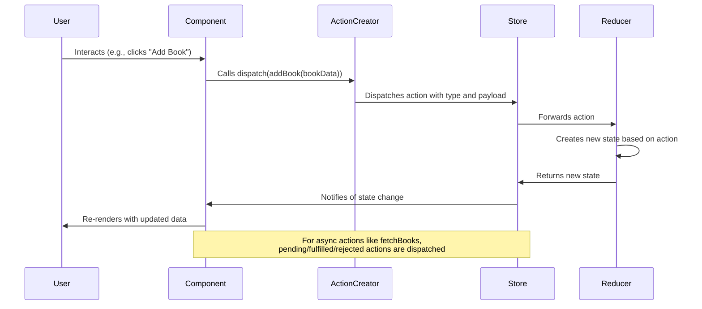

# Learn Redux

Redux is a predictable state container for JavaScript applications, commonly used with React. It helps you manage application state in a consistent way, making it easier to understand when, where, why, and how the state in your application is updated.

## Getting Started with Redux

Redux follows three fundamental principles:

1. **Single Source of Truth**: The entire state of your application is stored in a single JavaScript object called the "store".
2. **State is Read-Only**: The only way to change the state is to emit an action, which describes what happened.
3. **Changes are Made with Pure Functions**: Reducers are pure functions that take the previous state and an action, and return the next state.

## Real-world Implementation: ASafariM Bibliography

You can see a live implementation of Redux in our [ASafariM Bibliography application](https://bibliography.asafarim.com). This application demonstrates:

- Redux Toolkit with TypeScript
- Async thunks for API communication
- Error handling and loading states
- Database initialization and error recovery

The application showcases how Redux helps manage complex state in a real-world scenario, particularly when dealing with external API calls and error handling.

### Redux Flow

#### Redux Flow as Mermaid

The following is the redux flow as mermaid. Mermaid is a JavaScript-based charting and diagramming tool.

The flow is as follows:

1. UI Component dispatches an action.
2. Action creator creates the action.
3. Store dispatches the action.
4. Reducer handles the action and returns the new state.
5. UI component updates based on the new state.



### Redux Flow as SVG

<svg width="600" height="400" xmlns="http://www.w3.org/2000/svg">
  <!-- Boxes -->
  <rect x="50" y="50" width="150" height="60" rx="10" fill="#f9d5e5" stroke="#333" stroke-width="2"/>
  <rect x="50" y="250" width="150" height="60" rx="10" fill="#eeac99" stroke="#333" stroke-width="2"/>
  <rect x="400" y="50" width="150" height="60" rx="10" fill="#e06377" stroke="#333" stroke-width="2"/>
  <rect x="400" y="250" width="150" height="60" rx="10" fill="#c83349" stroke="#333" stroke-width="2"/>
  
  <!-- Labels -->
  <text x="125" y="85" font-family="Arial" font-size="16" text-anchor="middle" fill="#333">UI Component</text>
  <text x="125" y="285" font-family="Arial" font-size="16" text-anchor="middle" fill="#333">Action Creator</text>
  <text x="475" y="85" font-family="Arial" font-size="16" text-anchor="middle" fill="#333">Store</text>
  <text x="475" y="285" font-family="Arial" font-size="16" text-anchor="middle" fill="#333">Reducer</text>
  
  <!-- Arrows -->
  <path d="M125,110 L125,250" stroke="#333" stroke-width="2" fill="none" marker-end="url(#arrowhead)"/>
  <path d="M200,285 L400,285" stroke="#333" stroke-width="2" fill="none" marker-end="url(#arrowhead)"/>
  <path d="M475,250 L475,110" stroke="#333" stroke-width="2" fill="none" marker-end="url(#arrowhead)"/>
  <path d="M400,80 L200,80" stroke="#333" stroke-width="2" fill="none" marker-end="url(#arrowhead)"/>
  
  <!-- Arrow Labels -->
  <text x="95" y="180" font-family="Arial" font-size="14" fill="#333">Dispatch Action</text>
  <text x="300" y="270" font-family="Arial" font-size="14" fill="#333">Action</text>
  <text x="505" y="180" font-family="Arial" font-size="14" fill="#333">New State</text>
  <text x="300" y="60" font-family="Arial" font-size="14" fill="#333">State</text>
  
  <!-- Arrowhead definition -->
  <defs>
    <marker id="arrowhead" markerWidth="10" markerHeight="7" refX="10" refY="3.5" orient="auto">
      <polygon points="0 0, 10 3.5, 0 7" fill="#333"/>
    </marker>
  </defs>
</svg>

### Core Concepts

1. **Actions**: Plain JavaScript objects that have a `type` field. They describe "what happened" in the application.
2. **Action Creators**: Functions that create actions.
3. **Reducers**: Pure functions that take the current state and an action, and return a new state.
4. **Store**: Holds the state tree of your application. You can dispatch actions to change the state.
5. **Selectors**: Functions that extract specific pieces of information from the store state.

## Redux Toolkit

Redux Toolkit (RTK) is the official, opinionated, batteries-included toolset for efficient Redux development. It simplifies common Redux use cases and helps you avoid common mistakes.

### Key Features of Redux Toolkit

- **ConfigureStore**: Wraps `createStore` with simplified configuration options
- **CreateSlice**: Accepts a reducer function, a slice name, and initial state value, and automatically generates action creators and action types
- **CreateAsyncThunk**: Simplifies handling async logic and generates pending/fulfilled/rejected action types
- **CreateEntityAdapter**: Provides methods for normalizing state and CRUD operations

## Example: ASafariM Bibliography Project

Let's implement Redux in a bibliography management application using TypeScript and Redux Toolkit.

### Project Structure

```
src/
├── components/
│   ├── BookList.tsx
│   ├── BookForm.tsx
│   └── BookDetails.tsx
├── store/
│   ├── index.ts
│   └── slices/
│       └── bookSlice.ts
├── types/
│   └── Book.ts
└── App.tsx
```

### Define Types

```typescript
// src/types/Book.ts
export interface BaseEntity {
  id: string;
  createdAt?: Date;
  updatedAt?: Date;
  deletedAt?: Date;
  createdBy: string;
  updatedBy?: string;
  deletedBy?: string;
  isActive: boolean;
  isDeleted: boolean;
  deletedMessage?: string;
}

export interface Book extends BaseEntity {
  title: string;
  author: string;
  year: number;
  genre: string;
  isRead: boolean;
  attachmentId?: string;
}

export type BookFormData = Omit<Book, 'id' | 'createdAt' | 'updatedAt' | 'deletedAt' | 'updatedBy' | 'deletedBy' | 'isDeleted' | 'deletedMessage' | 'attachmentId'>;
```

### Create Redux Slice

```typescript
// src/store/slices/bookSlice.ts
import { createSlice, createAsyncThunk, PayloadAction } from '@reduxjs/toolkit';
import { Book, BookFormData } from '../../types/Book';

interface BookState {
  books: Book[];
  selectedBook: Book | null;
  loading: boolean;
  error: string | null;
}

const initialState: BookState = {
  books: [],
  selectedBook: null,
  loading: false,
  error: null,
};

// Async thunk for fetching books
export const fetchBooks = createAsyncThunk(
  'books/fetchBooks',
  async (_, { rejectWithValue }) => {
    try {
      const controller = new AbortController();
      const timeoutId = setTimeout(() => controller.abort(), 10000);
      
      const response = await fetch('/api/books', {
        signal: controller.signal
      });
      
      clearTimeout(timeoutId);
      
      if (!response.ok) {
        const errorText = await response.text();
        throw new Error(errorText || 'Failed to fetch books');
      }
      
      const data = await response.json();
      // Handle API response format with $values
      return data.$values || data;
    } catch (error) {
      return rejectWithValue(error.message || 'An unknown error occurred');
    }
  }
);

// Async thunk for adding a book
export const addBook = createAsyncThunk(
  'books/addBook',
  async (book: BookFormData, { rejectWithValue }) => {
    try {
      const controller = new AbortController();
      const timeoutId = setTimeout(() => controller.abort(), 10000);
      
      const response = await fetch('/api/books', {
        method: 'POST',
        headers: { 'Content-Type': 'application/json' },
        body: JSON.stringify(book),
        signal: controller.signal
      });
      
      clearTimeout(timeoutId);
      
      if (!response.ok) {
        const errorText = await response.text();
        throw new Error(errorText || 'Failed to add book');
      }
      
      return await response.json();
    } catch (error) {
      return rejectWithValue(error.message || 'An unknown error occurred');
    }
  }
);

const bookSlice = createSlice({
  name: 'books',
  initialState,
  reducers: {
    selectBook: (state, action: PayloadAction<string>) => {
      state.selectedBook = state.books.find(book => book.id === action.payload) || null;
    },
    clearSelectedBook: (state) => {
      state.selectedBook = null;
    },
    toggleReadStatus: (state, action: PayloadAction<string>) => {
      const book = state.books.find(book => book.id === action.payload);
      if (book) {
        book.isRead = !book.isRead;
      }
    },
    removeBook: (state, action: PayloadAction<string>) => {
      state.books = state.books.filter(book => book.id !== action.payload);
      if (state.selectedBook?.id === action.payload) {
        state.selectedBook = null;
      }
    },
  },
  extraReducers: (builder) => {
    builder
      // Handle fetchBooks
      .addCase(fetchBooks.pending, (state) => {
        state.loading = true;
        state.error = null;
      })
      .addCase(fetchBooks.fulfilled, (state, action) => {
        state.loading = false;
        state.books = action.payload;
      })
      .addCase(fetchBooks.rejected, (state, action) => {
        state.loading = false;
        state.error = action.payload as string;
      })
      // Handle addBook
      .addCase(addBook.pending, (state) => {
        state.loading = true;
        state.error = null;
      })
      .addCase(addBook.fulfilled, (state, action) => {
        state.loading = false;
        state.books.push(action.payload);
      })
      .addCase(addBook.rejected, (state, action) => {
        state.loading = false;
        state.error = action.payload as string;
      });
  },
});

export const { selectBook, clearSelectedBook, toggleReadStatus, removeBook } = bookSlice.actions;
export default bookSlice.reducer;
```

### Configure Store

```typescript
// src/store/index.ts
import { configureStore } from '@reduxjs/toolkit';
import bookReducer from './slices/bookSlice';

export const store = configureStore({
  reducer: {
    books: bookReducer,
  },
});

export type RootState = ReturnType<typeof store.getState>;
export type AppDispatch = typeof store.dispatch;
```

### Create Custom Hooks

```typescript
// src/hooks/reduxHooks.ts
import { TypedUseSelectorHook, useDispatch, useSelector } from 'react-redux';
import type { RootState, AppDispatch } from '../store';

// Use throughout your app instead of plain `useDispatch` and `useSelector`
export const useAppDispatch = () => useDispatch<AppDispatch>();
export const useAppSelector: TypedUseSelectorHook<RootState> = useSelector;
```

### Component Implementation

```tsx
// src/components/BookList.tsx
import React, { useEffect, useState } from 'react';
import { useAppDispatch, useAppSelector } from '../hooks/reduxHooks';
import { fetchBooks, selectBook } from '../store/slices/bookSlice';
import DatabaseErrorMessage from './DatabaseErrorMessage';

const BookList: React.FC = () => {
  const dispatch = useAppDispatch();
  const { books, loading, error } = useAppSelector(state => state.books);
  const [retryCount, setRetryCount] = useState(0);

  useEffect(() => {
    dispatch(fetchBooks());
  }, [dispatch, retryCount]);

  const handleRetry = () => {
    setRetryCount(prev => prev + 1);
  };

  if (loading) return <div className="text-center py-4">Loading books...</div>;
  
  if (error) {
    return <DatabaseErrorMessage error={error} onRetry={handleRetry} />;
  }

  return (
    <div className="book-list">
      <h2 className="text-2xl font-bold mb-4">My Bibliography</h2>
      {books.length === 0 ? (
        <p className="text-gray-400">No books in your bibliography yet.</p>
      ) : (
        <ul className="space-y-2">
          {books.map(book => (
            <li 
              key={book.id} 
              onClick={() => dispatch(selectBook(book.id))}
              className="p-3 bg-gray-800 rounded cursor-pointer hover:bg-gray-700"
            >
              <strong>{book.title}</strong> by {book.author} ({book.year})
              <span className={`ml-2 px-2 py-1 rounded text-xs ${book.isRead ? 'bg-green-700' : 'bg-yellow-700'}`}>
                {book.isRead ? 'Read' : 'Unread'}
              </span>
            </li>
          ))}
        </ul>
      )}
    </div>
  );
};

export default BookList;
```

### Redux Data Flow in the Application



## Benefits of Using Redux

1. **Predictable State Management**: Redux makes state changes predictable and transparent.
2. **Centralized State**: All application state is stored in one place.
3. **Debugging**: Time-travel debugging and action logging make it easier to track state changes.
4. **Middleware Support**: Easily extend Redux with middleware for logging, crash reporting, async actions, etc.
5. **Developer Tools**: Powerful Redux DevTools for monitoring and debugging.

## When to Use Redux

Redux is most useful in applications with:
- Complex state logic affecting multiple components
- Frequent state updates
- Medium to large-sized codebase
- Significant team collaboration

For smaller applications or simpler state requirements, consider using React's built-in Context API or other lighter alternatives.

## Best Practices

1. **Keep Redux State Minimal**: Only store truly shared state in Redux.
2. **Use Redux Toolkit**: It simplifies common Redux patterns and reduces boilerplate.
3. **Normalize Complex State**: Use normalized state structure for collections of items.
4. **Avoid Deep Nesting**: Keep state structure flat for easier updates.
5. **Use Selectors**: Create reusable selectors for accessing and computing derived state.

## Explore the Live Example

Visit our [ASafariM Bibliography application](https://bibliography.asafarim.com) to see Redux in action. The application demonstrates all the concepts discussed in this guide, including:

- Redux store configuration
- Async thunks for API calls
- Error handling with retry mechanisms
- TypeScript integration

For more information on data fetching patterns, check out our [useFetch hook documentation](/asafarim-blog/docs/React/Hooks/useFetch) and [API data handling guide](/asafarim-blog/docs/React/Basics/handle-data-from-api).
