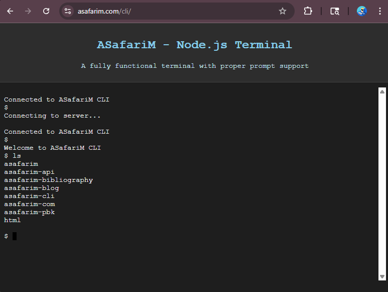
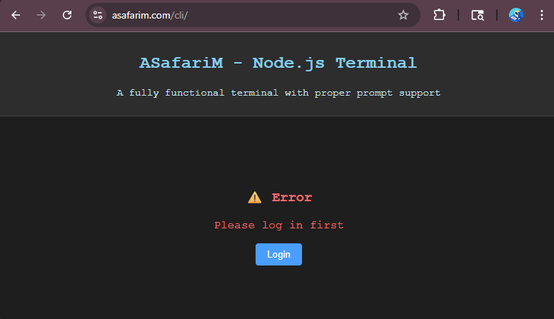

# ASafariM Node.js Terminal

A web-based terminal emulator built with Node.js, Express, Socket.IO and xterm.js, with secure authentication and role-based access control.

**Logged In:**



**Logged Out:**



These images show the terminal interface in both authenticated and unauthenticated states.

## Features

- Real-time terminal emulation in browser
- Secure authentication with JWT tokens (login/logout endpoints)
- Role-based access control (Admin + SuperAdmin required)
- Custom color scheme and prompt styling
- Responsive, adaptive design
- Support for standard shell commands (bash)
- Command history navigation (up/down arrows)
- Tab completion (where supported by shell)
- Window resizing (auto fit)
- Error and session handling (with clear error messages)
- Health check endpoint for service monitoring
- Session validation against the main API
- Secure WebSocket connections
- Admin and SuperAdmin required for access

## Installation

1. Clone the repository
2. Install dependencies:

```bash
pnpm install
```

3. Configure environment variables in `.env`:
```bash
PORT=3001
JWT_SECRET=your_jwt_secret
API_URL=https://asafarim.com/api
```

4. Start the server:

```bash
pnpm start
```

5. Open browser to <http://localhost:3001>

## Project Structure

```
asafarim-cli/
├── public/            # Static files
│   └── index.html     # Terminal web interface
├── server.js          # Node.js server
├── package.json       # Project configuration
├── .env              # Environment variables
└── README.md         # Documentation
```

## Dependencies

### Runtime

- express: Web server framework
- socket.io: Real-time communication
- jsonwebtoken: JWT authentication
- cookie-parser: Cookie handling
- node-fetch: HTTP client
- xterm-headless: Terminal emulation

### Development

- dotenv: Environment variables
- nan: Native abstractions

### Client-side

- xterm.js: Terminal emulator in browser
- socket.io-client: Real-time communication

## Scripts

- `pnpm start`: Start the server
- `pnpm restart`: Reinstall dependencies and restart
- `pnpm clean`: Remove dependencies
- `pnpm reinstall`: Clean install of dependencies
- `pnpm build:prod`: Production build (installs production dependencies only)
- `pnpm build:dev`: Development build (includes rebuild of native modules)
- `pnpm kill`: Kill all running CLI server processes

## Configuration

The server can be configured via environment variables:

- `PORT`: Server port (default: 3001)
- `JWT_SECRET`: Secret for JWT token verification
- `API_URL`: URL of the main API server

## Usage

### Accessing the CLI

1. Log in at [asafarim.com](https://asafarim.com) with an Admin or SuperAdmin account.
2. Visit [https://asafarim.com/cli](https://asafarim.com/cli) in your browser.
3. If not authenticated, you'll see a login prompt (see image above). If authenticated and authorized, the terminal will appear.

### Terminal Functionalities
- **Shell Commands:** Enter any standard bash command. Output is streamed in real time.
- **Command History:** Use Up/Down arrows to navigate previous/next commands.
- **Tab Completion:** Use Tab to auto-complete commands or paths (if supported by the shell).
- **Window Resizing:** Terminal automatically fits to browser window size.
- **Prompt:** Custom prompt styling for clarity.
- **Session Expiry/Error:** If your session expires or you lose access, you will be prompted to log in again or see an error message.

### Authentication & Authorization
- **Login:** Handled via `/api/auth/login` (forwards credentials to main API; sets JWT token as cookie).
- **Logout:** `/api/auth/logout` clears the JWT token and session.
- **Health Check:** `/health` endpoint returns service status (no authentication required).
- **Role Check:** Only Admin or SuperAdmin can access the terminal. Session is validated against the main API.
- **Session Validation:** Uses JWT and checks user roles. If invalid, access is denied and you are logged out.

### Error Handling
- Clear error messages for authentication, authorization, and command execution errors.
- Retry and re-authenticate options provided in the UI.

### Example Workflow
1. Log in at [asafarim.com](https://asafarim.com/login).
2. Navigate to the CLI page.
3. Run commands, navigate history, and use tab completion as needed.
4. If your session expires, use the "Try Again" button to re-authenticate.

## Security

- JWT token authentication required
- Admin and SuperAdmin roles required
- Session validation against main API
- Secure WebSocket connections

## Troubleshooting

If you can't access the terminal:

1. Ensure you're logged in at [asafarim.com](https://asafarim.com)
2. Verify you have Admin and SuperAdmin privileges
3. Check browser console for authentication or network errors
4. Use the "Try Again" button to re-authenticate
5. Confirm your browser allows cookies and JavaScript
6. If issues persist, check the server logs for errors (see `server.js` output)
7. For deployment issues, verify that the health check endpoint (`/health`) returns status `ok`

## Deployment

### Prerequisites

- Node.js 18+ installed
- PM2 for process management (`pnpm add -g pm2`)
- Nginx as reverse proxy
- Domain configured (asafarim.com)

### Steps

1. Build for production:

   ```bash
   pnpm build:prod
   ```

2. Start with PM2:

   ```bash
   pm2 start server.js --name "asafarim-cli"
   ```

3. Configure Nginx as a reverse proxy (see below for sample config).
4. Restart Nginx:

   ```bash
   sudo systemctl restart nginx
   ```

5. Ensure environment variables (`.env`) are set:
   - `PORT` (default: 3001)
   - `JWT_SECRET` (required)
   - `API_URL` (main API base URL)

6. Health check endpoint: `GET /health` should return `{ status: 'ok', ... }`
## License

[MIT](LICENSE)
