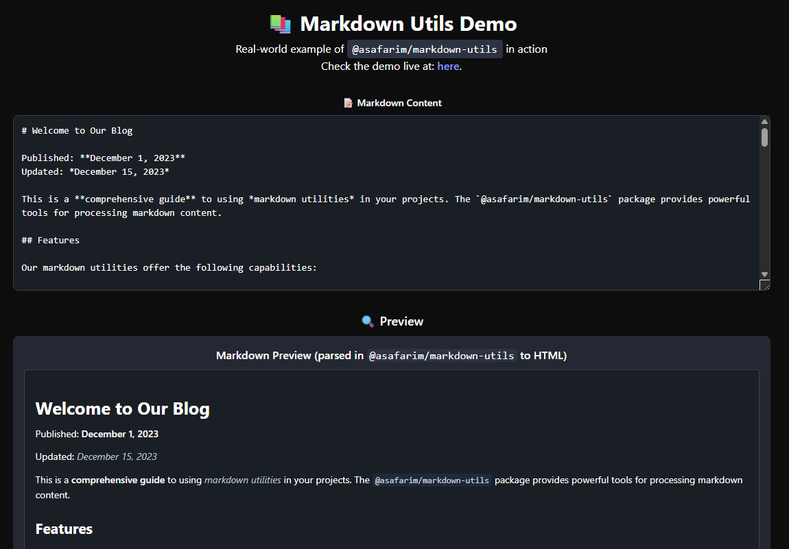

# @asafarim/markdown-utils

[](https://badge.fury.io/js/@asafarim%2Fmarkdown-utils)
[](https://opensource.org/licenses/MIT)
[](http://www.typescriptlang.org/)

A comprehensive collection of utility functions for markdown processing, metadata extraction, content parsing, and validation. Built with TypeScript for excellent developer experience and type safety.



> **🎯 Live Demo**: Experience the full functionality at [bibliography.asafarim.com/markdown-utils/demo](https://bibliography.asafarim.com/markdown-utils/demo)

## ✨ What's New

- **🔄 HTML Conversion** - New `markdownToHtml()` function for converting markdown to HTML
- **🎨 Theme Support** - Built-in support for light/dark mode styling in demo components
- **📊 Enhanced Analytics** - Improved content analysis with better metadata extraction
- **🔍 Real-time Validation** - Live markdown validation with detailed error reporting
- **📱 Responsive Design** - Demo components work seamlessly across all devices

## 🚀 Features

- **📅 Date Utilities** - Extract creation/update dates from markdown content
- **📝 Content Parsing** - Extract headings, paragraphs, links, images, and code blocks  
- **� HTML Conversion** - Convert markdown to HTML with the new `markdownToHtml()` function
- **�🔧 Path Utilities** - Handle file paths, slugs, and directory operations
- **✅ Validation** - Validate markdown syntax, links, images, and tables with detailed feedback
- **📊 Content Analysis** - Word count, reading time, and content structure analysis
- **🎯 TypeScript Support** - Full type definitions included
- **🌳 Tree Shakable** - Import only what you need
- **📦 Multiple Formats** - ESM and CommonJS support
- **🎨 Theme Aware** - Built-in support for light/dark mode in demo components

## 📦 Installation

```bash
npm install @asafarim/markdown-utils
```

```bash
yarn add @asafarim/markdown-utils
```

```bash
pnpm add @asafarim/markdown-utils
```

## 🏁 Quick Start

### Named Imports (Recommended)

```typescript
import { 
  getFirstHeading, 
  getCreationDate, 
  stripMarkdown,
  validateMarkdown,
  markdownToHtml,
  getWordCount,
  getReadingTime
} from '@asafarim/markdown-utils';

const content = `
# My Document
Created: 2024-12-07

**Bold text** and *italic text*.

Check out this [link](https://example.com) and enjoy!
`;

// Extract heading
const title = getFirstHeading(content); // "My Document"

// Extract date
const created = getCreationDate(content); // Date object

// Get plain text
const plainText = stripMarkdown(content); // Clean text without markdown

// Convert to HTML
const htmlContent = markdownToHtml(content); // HTML string

// Get content stats
const wordCount = getWordCount(content); // 12
const readingTime = getReadingTime(content); // 1

// Validate content
const validation = validateMarkdown(content);
console.log(validation.isValid); // true
console.log(validation.stats); // Detailed statistics
```

### Default Import

```typescript
import markdownUtils from '@asafarim/markdown-utils';

// Use grouped utilities
const title = markdownUtils.content.getFirstHeading(content);
const created = markdownUtils.date.getCreationDate(content);
const isValid = markdownUtils.validation.isValidMarkdown(content);
```

## 📚 API Reference

### Date Utilities

Extract and work with dates from markdown content:

```typescript
import { 
  getCreationDate, 
  getUpdateDate, 
  formatDate, 
  getTimeAgo 
} from '@asafarim/markdown-utils';

// Extract dates from various patterns
const created = getCreationDate('Date: 2024-12-07');
const updated = getUpdateDate('Updated: December 8, 2024');

// Format dates
const formatted = formatDate(new Date()); // "Dec 7, 2024"
const timeAgo = getTimeAgo(new Date(Date.now() - 86400000)); // "1 day ago"
```

### Content Parsing

Parse and extract content from markdown:

```typescript
import { 
  getFirstHeading,
  getAllHeadings,
  extractLinks,
  extractImages,
  extractCodeBlocks,
  getWordCount,
  getReadingTime,
  getFirstParagraph,
  stripMarkdown,
  markdownToHtml
} from '@asafarim/markdown-utils';

const content = `
# Main Title
## Subtitle

Check out [my website](https://example.com) and this .

\`\`\`javascript
console.log('Hello World');
\`\`\`

Here's some **important** content for analysis.
`;

const title = getFirstHeading(content); // "Main Title"
const headings = getAllHeadings(content); // Array of heading objects with levels
const links = extractLinks(content); // Array of link objects with URLs and text
const images = extractImages(content); // Array of image objects with src and alt
const codeBlocks = extractCodeBlocks(content); // Array of code blocks with language
const wordCount = getWordCount(content); // Number of words
const readingTime = getReadingTime(content); // Estimated minutes
const firstParagraph = getFirstParagraph(content); // First paragraph text
const plainText = stripMarkdown(content); // Clean text without markdown
const htmlContent = markdownToHtml(content); // Converted to HTML
```

### Path Utilities

Handle file paths and create slugs:

```typescript
import { 
  getFileNameWithoutExtension,
  filenameToSlug,
  filenameToTitle,
  extractDateFromPath,
  isMarkdownFile
} from '@asafarim/markdown-utils';

const filePath = '/docs/2024-12-07_my-great-article.md';

const filename = getFileNameWithoutExtension(filePath); // "2024-12-07_my-great-article"
const slug = filenameToSlug('My Great Article!'); // "my-great-article"
const title = filenameToTitle('2024-12-07_my-great-article'); // "My Great Article"
const date = extractDateFromPath(filePath); // Date object for 2024-12-07
const isMarkdown = isMarkdownFile(filePath); // true
```

### Validation

Validate markdown content and syntax with detailed feedback:

```typescript
import { 
  validateMarkdown,
  validateMarkdownLinks,
  validateMarkdownImages,
  isValidMarkdown
} from '@asafarim/markdown-utils';

const content = `# Title\n[Link](https://example.com)\n`;

// Comprehensive validation
const validation = validateMarkdown(content);
console.log(validation.isValid); // true
console.log(validation.stats); // { wordCount: 2, headingCount: 1, linkCount: 1, ... }
console.log(validation.errors); // Array of error messages
console.log(validation.warnings); // Array of warning messages

// Specific link validation
const linkValidation = validateMarkdownLinks(content);
console.log(linkValidation[0].isValid); // true
console.log(linkValidation[0].url); // "https://example.com"

// Image validation
const imageValidation = validateMarkdownImages(content);
console.log(imageValidation[0].src); // "photo.jpg"
console.log(imageValidation[0].alt); // "Image"

// Simple validation
const isValid = isValidMarkdown(content); // true
```

## 🎯 Use Cases

### Blog/Documentation Systems

```typescript
import { 
  getFirstHeading, 
  getCreationDate, 
  getReadingTime, 
  getWordCount, 
  markdownToHtml,
  getFirstParagraph 
} from '@asafarim/markdown-utils';

function processMarkdownPost(content: string) {
  return {
    title: getFirstHeading(content),
    excerpt: getFirstParagraph(content),
    publishedAt: getCreationDate(content),
    readingTime: getReadingTime(content),
    wordCount: getWordCount(content),
    htmlContent: markdownToHtml(content)
  };
}
```

### React/Vue Components with HTML Preview

```typescript
import { markdownToHtml } from '@asafarim/markdown-utils';

function MarkdownPreview({ content }: { content: string }) {
  const htmlContent = markdownToHtml(content);
  
  return (
    <div 
      className="markdown-content"
      dangerouslySetInnerHTML={{ __html: htmlContent }}
    />
  );
}
```

### Static Site Generators

```typescript
import { 
  extractDateFromPath, 
  filenameToSlug, 
  filenameToTitle,
  markdownToHtml,
  validateMarkdown 
} from '@asafarim/markdown-utils';

function processMarkdownFiles(filePaths: string[]) {
  return filePaths.map(path => {
    const content = fs.readFileSync(path, 'utf-8');
    const validation = validateMarkdown(content);
    
    return {
      slug: filenameToSlug(path),
      title: filenameToTitle(path),
      date: extractDateFromPath(path),
      htmlContent: markdownToHtml(content),
      isValid: validation.isValid,
      path
    };
  });
}
```

### Content Validation Pipeline

```typescript
import { validateMarkdown, validateMarkdownLinks } from '@asafarim/markdown-utils';

function validateContentPipeline(content: string) {
  const result = validateMarkdown(content);
  const linkResults = validateMarkdownLinks(content);
  
  // Check for broken links
  const brokenLinks = linkResults.filter(link => !link.isValid);
  
  if (!result.isValid) {
    console.error('Validation errors:', result.errors);
    return { success: false, errors: result.errors };
  }
  
  if (brokenLinks.length > 0) {
    console.warn('Broken links found:', brokenLinks.map(link => link.url));
  }
  
  if (result.warnings.length > 0) {
    console.warn('Content warnings:', result.warnings);
  }
  
  return { 
    success: true, 
    stats: result.stats,
    brokenLinks: brokenLinks.length 
  };
}
```

## 🌟 Demo & Examples

Experience the full power of @asafarim/markdown-utils in our interactive demo:

**🔗 [Live Demo](https://bibliography.asafarim.com/markdown-utils/demo)**

The demo showcases:
- ✅ Real-time markdown validation with error highlighting
- 📊 Content analysis including word count, reading time, and structure
- 🔄 Live HTML preview with theme support
- 📁 File operations and metadata extraction
- 🎨 Light/dark mode compatibility

### Demo Features
- **Content Analysis Tab**: View detailed statistics about your markdown
- **Validation Tab**: See validation results with specific error messages  
- **File Operations Tab**: Explore path utilities and file processing
- **HTML Preview**: See real-time conversion from markdown to HTML

## 🛠️ Development

```bash
# Clone the repository
git clone https://github.com/AliSafari-IT/asafarim.git
cd asafarim/ASafariM.Clients/packages/markdown-utils

# Install dependencies (using pnpm workspace)
pnpm install

# Run tests
pnpm test

# Run tests with coverage
pnpm test:coverage

# Build the package
pnpm build

# Run linting
pnpm lint

# Run the demo locally (from bibliography app)
cd ../../asafarim-bibliography
pnpm dev
# Navigate to /markdown-utils/demo
```

### Monorepo Structure

This package is part of the ASafariM monorepo:
```
asafarim/
├── ASafariM.Clients/
│   ├── packages/
│   │   └── markdown-utils/          # This package
│   └── asafarim-bibliography/       # Demo integration
```

## 🔄 Recent Improvements

### v1.3.0 - Enhanced HTML Conversion & Theming
- ✨ Added `markdownToHtml()` function for HTML conversion
- 🎨 Improved theme support in demo components  
- 📊 Enhanced content analysis with better metadata extraction
- 🔍 Real-time validation with detailed error reporting
- 📱 Responsive design improvements for mobile devices
- 🌙 Full light/dark mode compatibility

### v1.2.0 - Validation & Analysis
- ✅ Comprehensive markdown validation with error details
- 📈 Content statistics and reading time calculation
- 🔗 Link and image validation with status reporting
- 🧩 Code block extraction with language detection

## 🤝 Contributing

Contributions are welcome! Please feel free to submit a Pull Request. For major changes, please open an issue first to discuss what you would like to change.

1. Fork the repository
2. Create your feature branch (`git checkout -b feature/amazing-feature`)
3. Commit your changes (`git commit -m 'Add some amazing feature'`)
4. Push to the branch (`git push origin feature/amazing-feature`)
5. Open a Pull Request

### Development Guidelines
- Write tests for new features
- Follow TypeScript best practices
- Update documentation for API changes
- Test the demo integration in the bibliography app

## 📄 License

This project is licensed under the MIT License - see the [LICENSE](LICENSE) file for details.

## 🙏 Acknowledgments

- Built with [TypeScript](https://www.typescriptlang.org/) for type safety
- Bundled with [tsup](https://tsup.egoist.dev/) for efficient builds
- Tested with [Vitest](https://vitest.dev/) for reliable testing
- Demo integration with React and theme-aware components
- Part of the ASafariM ecosystem for academic and research tools

## 📞 Support

- 🌐 **Live Demo**: [bibliography.asafarim.com/markdown-utils/demo](https://bibliography.asafarim.com/markdown-utils/demo)
- 📧 **Email**: asafarim@gmail.com
- 🐛 **Issues**: [GitHub Issues](https://github.com/AliSafari-IT/asafarim/issues)
- 💬 **Discussions**: [GitHub Discussions](https://github.com/AliSafari-IT/asafarim/discussions)
- 📦 **NPM Package**: [@asafarim/markdown-utils](https://www.npmjs.com/package/@asafarim/markdown-utils)

---

Made with ❤️ by [Ali Safari](https://github.com/AliSafari-IT)
